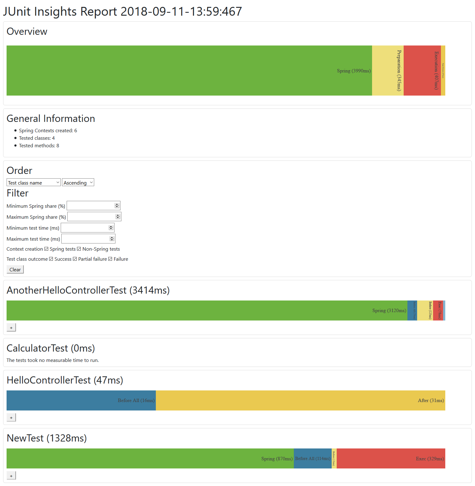

[  ](https://bintray.com/adesso/junit-insights/junit-insights)
[](https://travis-ci.org/adessoAG/junit-insights)
[](https://codebeat.co/projects/github-com-adessoag-junit-insights-master)
# JUnit Insights
JUnit Insights is an extension for JUnit 5 (optionally in combination with the Spring framework), which
1. measures the time for setup, execution and teardown for each test method in each test class
2. (optional) measures how often Spring contexts were created and how long this takes
2. creates a nice looking report that visualizes the data (see screenshot below)

**Background:** When building integration tests with Spring (e.g. with @SpringBootTest), sometimes a Spring application context has to be started and sometimes it doesn't.
For the user of the test classes, it looks like some tests take a long time to execute, although the actual test runs fairly quickly.
To make this behavior transparent, a report is created.

# Usage

You can add the extension via the provided [bintray package](https://bintray.com/adesso/junit-insights/junit-insights) in your build file:

Maven:
```xml
<repositories>
    <repository>
        <id>bintray.com</id>
        <url>https://dl.bintray.com/adesso/junit-insights</url>
    </repository>
</repositories>

<dependencies>
    <dependency>
        <groupId>de.adesso</groupId>
        <artifactId>junit-insights</artifactId>
        <version>0.0.1</version>
    </dependency>
</dependencies>
```

Gradle:
```gradle
repositories {
    maven {
        url  "https://dl.bintray.com/adesso/junit-insights"
    }
}

dependencies {
    testCompile ('de.adesso:junit-insights:0.0.1')
}
```

Then, add `@JUnitInsights` to the test classes you want to benchmark.
If you want to exclude methods from the benchmark, add `@NoJUnitInsights` to those.
Be aware that ExtendsWith(SpringExtension::class) needs to be used as Runner-class.

Alternatively, if you want to add the extension to all your test classes, you only have to activate autodetection for JUnit 5 your build file:

Maven: TODO not tested!!!!!!!!!
```xml
<build>
    <plugins>
        ...
        <plugin>
            <groupId>de.adesso</groupId>
            <artifactId>junit-insights</artifactId>
            <version>0.0.1</version>
            <configuration>
                <properties>
                    <configurationParameters>
                        junit.jupiter.extensions.autodetection.enabled = true
                    </configurationParameters>
                </properties>
            </configuration>
        </plugin>
    </plugins>
</build>
...
```

Gradle:
```gradle
test {
    systemProperty 'junit.jupiter.extensions.autodetection.enabled', 'true'
}
```
Further information can be found [here](https://junit.org/junit5/docs/current/user-guide/#extensions-registration-automatic)

# How time is measured
The extension captures certain events in during the test plan execution to measure the time for each phase:

TODO explain how

# Troubleshooting

If you get an error complaining about a missing JUnit platform launcher, for example

```
java.lang.ClassNotFoundException: org.junit.platform.launcher.TestExecutionListener
```
you need to add the dependency for the [appropriate package](https://mvnrepository.com/artifact/org.junit.platform/junit-platform-launcher).

If you have any other issues, feel free to open an issue in our issue tracker.

# Screenshot

